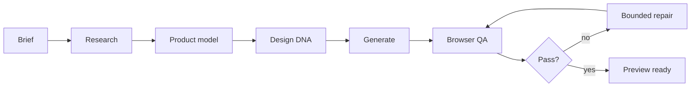

<div align="center">
  <h1>WEBFORGE</h1>
  <p><strong>Experimental web-product factory: from a structured brief to a locally verified preview.</strong></p>
  <p>
    
    
    
    
  </p>
</div>

> **Portfolio status:** Experimental reference prototype. Local preview can be verified; live connectors, external hosting and production release are not implied.

WEBFORGE explores how far a structured brief can travel through research, product modeling, design, generation and browser QA before a human has to take over.



## One command

```bash
npm run doctor
npm test
node src/cli/webforge.mjs factory "Premium techno club in Prague with events, artists, tickets and gallery."
npm start
```

HTTP: `POST /api/factory/run` with `{ "brief": "..." }`.

## Autonomous loop

Research → Product Model → Design DNA → Component Synthesis → Content/Media Fulfillment → Connector Plan → Runtime Build Gate → Chromium QA → Critique → Bounded Auto-Repair → Preview Ready → Production Gate.

## Truth boundary

Portable preview can PASS locally. Native framework dependency build, live external connector execution, external hosting and production release remain UNVERIFIED/BLOCKED until actually executed and evidenced. `READY != PASS`. Production requires all gates plus explicit approval.

## 9.1 Federated Component Pack R1

WEBFORGE can now resolve external component candidates through a governed federated registry layer. It uses the public shadcn registry directory as a discovery bus, ranks sources against the project's capabilities and Design DNA, inspects only the selected exact item, and requires policy/license approval before installation.

```bash
npm run federated:smoke
node src/cli/webforge.mjs components sources
node src/cli/webforge.mjs components search "cinematic event hero tickets"
```

External registry availability is never inferred from configuration alone: `UNVERIFIED != PASS`.
